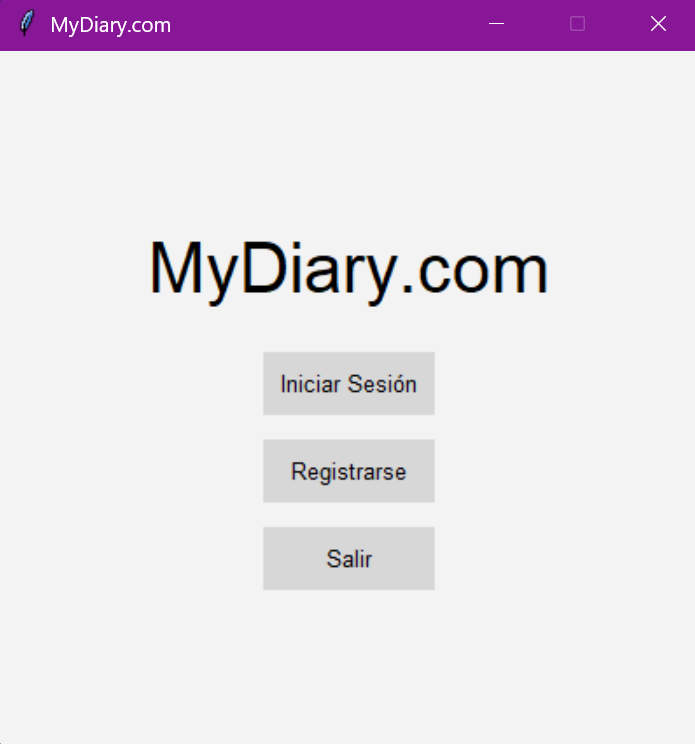
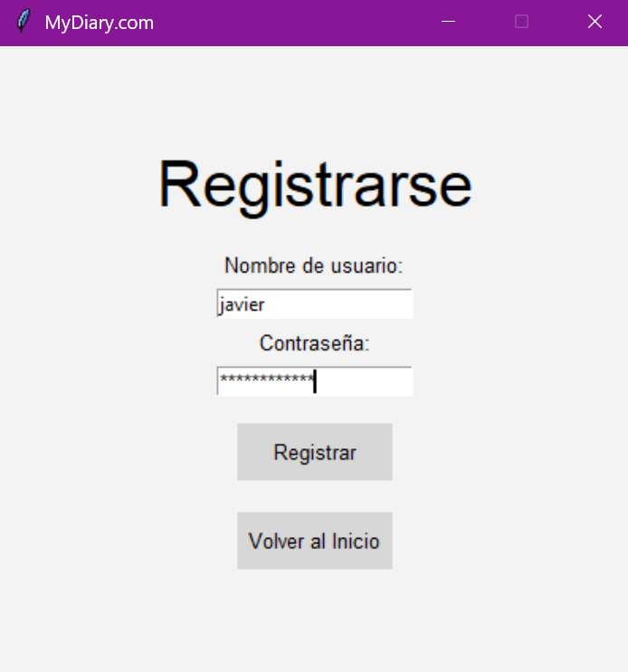
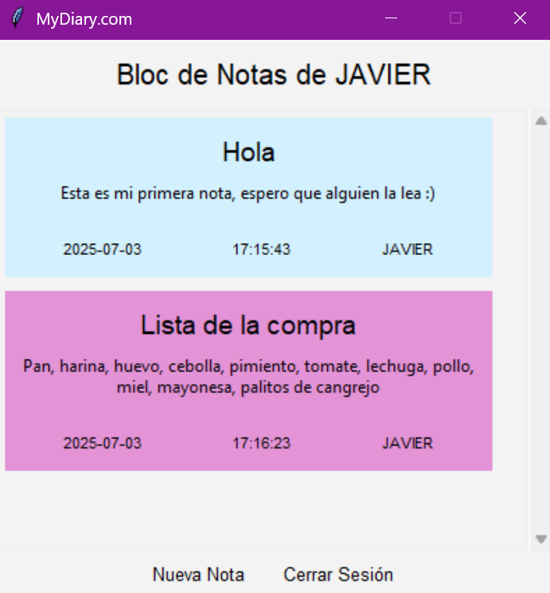

# 📝 MY DIARY: UN BLOC DE NOTAS CIFRADAS

## 🙆‍♂️ Autores
- Javier Rosales Lozano
- Manuel Roldán Matea
- Última modificación: 03/07/2025
Grupo: 17

## 🌐 Descripción

Trabajo de prácticas (2024-2025) para la asignatura de Criptografía y Seguridad Informática del Grado en Ingeniería Informática.

Universidad Carlos III de Madrid.

### 📖 Resumen

Implementación de una aplicación de cifrado de datos con el uso de diversas funcionalidades relacionadas con la
criptografía, con algoritmos de cifrado y buenas prácticas de programación. La función principal de la aplicación
gestiona el registro, inicio de sesión, creación y cifrado de notas de cada usuario (se cifra el contenido y
formato de éstas).

#### __Primera entrega__:

- Crear y gestionar notas cifradas por usuario almacenadas en archivos JSON.
- Registro e inicio de sesión por username y contraseña, cifrados junto a un token para autenticar futuros accesos.
- Cifrado de notas mediante __AES_GCM__; almacenamiento por separado en un archivo por usuario.
- Asegurar confidencialidad, integridad y autenticación de la información mediante la clase `BlocNotas`, que gestiona internamente
la lista de notas cifradas.

#### __Segunda entrega__:

- Firma digital de notas mediante un __certificado X.509__, generado a partir de un CSR firmado con la clave privada del sistema (RSA 2048 bits).
- Firma de notas al crearse, almacenando la firma en un archivo JSON independiente.
- Validación de firmas mediante el certificado X.509 mencionado, asegurando autenticidad e integridad.
- Generación de un __CSR (Certificate Signing Request)__ para el sistema, que se firma con la clave privada del sistema.
- Generación de un par de claves pública/privada para el sistema, almacenando la clave pública en un certificado X.509.

### 🎮 Controles

- Hacer click con el ratón en los botones de la interfaz para interactuar con la aplicación.
- Usar el teclado para interaccionar con los campos de texto.

## 🚧 Estructura del proyecto

```plaintext
├── data/                                 // Carpeta de datos criptográficos
│   ├── notes/                            // Notas cifradas de los usuarios de los usuarios (JSON)
│   ├── pks/                              // Par de claves pública/privada del sistema
│   │   ├── Acert.pem/                    // Certificado de clave pública (PEM)
│   │   └── pkv.pem                       // Clave privada (PEM)
│   ├── reqx509/                          // Solicitud de firma de certificado (CSR)
│   │   └── Areq.pem                      // CSR del sistema
│   ├── signs/                            // Firmas de las notas de los usuarios (JSON)
│   └── usuarios.json                     // Usuarios registrados y contraseñas cifradas
├── docs/                                 // Documentación del proyecto
│   ├── enunciado2425.pdf                 // Enunciado de la práctica (Partes 1 y 2)
│   ├── labOpenSSL.pdf                    // Laboratorio de introducción a OpenSSL
│   ├── memoria1.pdf                      // Memoria de la primera entrega
│   └── memoria2.pdf                      // Memoria de la segunda entrega
├── openssl/                              // Laboratorio de introducción a OpenSSL
├── src/                                  // Código fuente de la aplicación
│   ├── aesgcm.py                         // Cifrado y descifrado de notas con AES GCM
│   ├── app.py                            // Interfaz gráfica de Tkinter
│   ├── constants.py                      // Constantes del proyecto
│   ├── generate_pair_key.py              // Generación del par de claves pública/privada
│   ├── key.py                            // Clase para la gestión de claves
│   ├── note.py                           // Clase para la gestión de notas
│   ├── register_authenticate.py          // Registro y autenticación de usuarios
│   ├── screens.py                        // Pantallas de Tkinter que componen la aplciación
│   └── sign_validation.py                // Validación de firmas de notas
├── venv/                                 // Entorno virtual (opcional)
├── gitignore.py                          // Archivo .gitignore
├── csr.py                                // Generación del CSR del sistema
├── main.py                               // Punto de entrada de la aplicación
├── README.md                             // Este archivo
└── requirements.txt                      // Dependencias del proyecto
```

## 🔗 Dependencias

- Cryptography: `pip install cryptography`
- Tkinter: `pip install tk`
- Base64: `pip install base64`

## 📝 Requisitos

- Python 3.10 o superior

## 📥 Instalación y uso

1. __Clonar el repositorio__ y activar el entorno virtual (opcional).

```
venv/Scripts/activate
```

2. __Instalar las dependencias__ del proyecto:

```
pip install -r requirements.txt
```

3. __Generar el CSR del sistema__ ejecutando el siguiente comando:

```
python csr.py
```

4. __Ejecutar la aplicación__:

```
python main.py
```

## 📷 Capturas de pantalla







## 🤝 Referencias
- [Biblioteca Cryptography](https://cryptography.io/en/latest/)
- [Biblioteca Tkinter](https://docs.python.org/3/library/tkinter.html)
- [Biblioteca Base64](https://docs.python.org/3/library/base64.html)